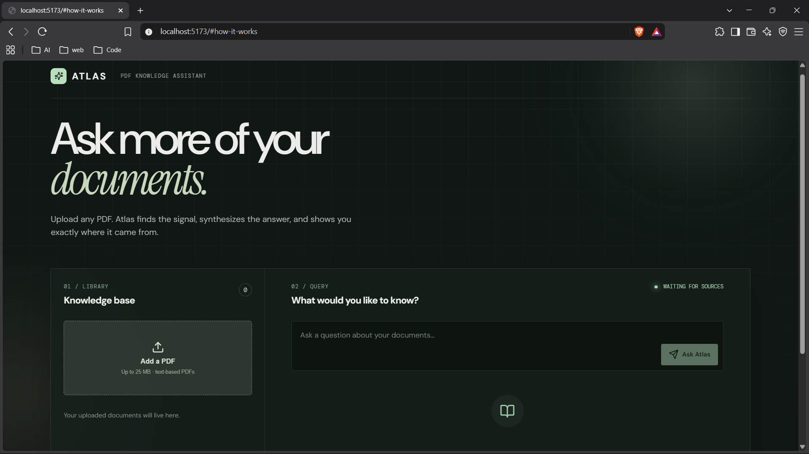

# Atlas — PDF Knowledge Assistant

An end-to-end Retrieval-Augmented Generation (RAG) app for asking cited questions about PDF documents.

## Interface preview

Atlas provides a focused workspace for uploading PDF documents, asking natural-language questions, and reviewing source-grounded responses with page citations.



## Stack

- **Frontend:** React + Vite + custom CSS (no UI framework required)
- **Backend:** FastAPI + PyMuPDF + LangChain (recursive splitter, Hugging Face embeddings, in-memory vector store)
- **Generation:** OpenAI, when `OPENAI_API_KEY` is configured; otherwise a source-grounded extractive response

## Run locally

### 1. Backend

```powershell
cd backend
python -m venv .venv
.\.venv\Scripts\Activate.ps1
pip install -r requirements.txt
uvicorn app.main:app --reload --port 8000
```

Copy `.env.example` to `.env` and set `OPENAI_API_KEY` if you want generative answers.

### 2. Frontend

```powershell
cd frontend
npm install
npm run dev
```

Visit `http://localhost:5173`. The Vite development server proxies API calls to the backend.

## API

- `POST /api/upload` — multipart PDF upload; returns document and chunk counts.
- `POST /api/ask` — JSON `{ "question": "..." }`; returns answer and page citations.
- `GET /api/documents` — indexed documents.
- `DELETE /api/documents/{id}` — remove an indexed document.

The included LangChain `InMemoryVectorStore` is process-local and intentionally simple for local use. Replace it with Chroma, Qdrant, or pgvector for multi-user/production persistence.
